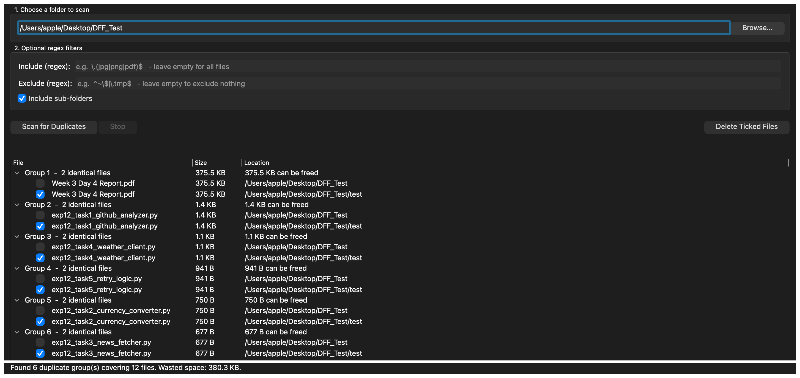
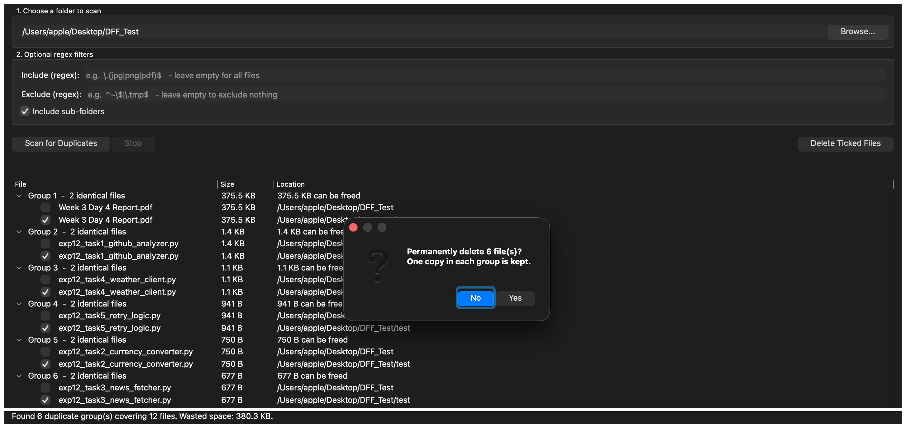

# Duplicate File Finder

A Python desktop application that scans a folder for duplicate files using **file reading + hashing**, groups them, and lets you filter with **regular expressions** — built with a **PyQt5** GUI.

- **Intern:** Waleed Ahmad Khan
- **Reg No:** Mtech-PY26017
- **Concepts:** File Handling + Regex
- **GUI Toolkit:** PyQt5
- **Level:** Advanced

---

## What it does

Over time a computer collects the same file many times over — photos copied from a phone twice, `report_final.pdf` saved again as `report_final(1).pdf`, repeated downloads, duplicated backup folders. These copies waste disk space and clutter your folders.

This app scans a folder (and its sub-folders), finds files whose **contents** are byte-for-byte identical, groups them together, and reports exactly how much space is wasted. You can then delete the extra copies while always keeping one original.

## How duplicates are detected

Comparing every file against every other file would be far too slow, so the scan runs in **two passes**:

**Pass 1 — group by size.** Two files of different sizes can never be identical, so any file with a unique size is discarded immediately. This is very fast because sizes come from the file system without opening the files.

**Pass 2 — group by hash.** Only files sharing a size are actually read. Each is read in **64 KB chunks** (never all at once, so a huge file can't exhaust memory) and fed into a **SHA-256** hash. Files producing the same hash have identical contents.

This means two files that happen to be the same size but hold different data are correctly **not** reported as duplicates.

## Regular expressions

Two optional regex filters control which files are scanned:

- **Include** — only file names matching this pattern are considered
- **Exclude** — file names matching this pattern are skipped

Examples:

| Goal | Pattern | Field |
|---|---|---|
| Only images | `\.(jpg|png|gif)$` | Include |
| Only documents | `\.(pdf|docx?)$` | Include |
| Skip temp Office files | `^~\$` | Exclude |
| Skip anything with "backup" | `backup` | Exclude |

Invalid patterns are caught and reported before the scan starts.

## Features

- Browse for any folder, with an optional "include sub-folders" toggle
- Two regex filters (include / exclude), validated before scanning
- Two-pass size-then-hash detection for speed
- Chunked reading so very large files never exhaust memory
- **Runs on a background thread** — the window stays responsive, with a live progress bar and a Stop button
- Results shown in a grouped tree with per-group reclaimable space
- Total wasted space reported in readable units (KB / MB / GB)
- Safe deletion: the first file in each group is left unticked, so you can never delete every copy; a confirmation dialog appears before anything is removed
- Handles unreadable files, permission errors and invalid regex without crashing

## Requirements

- **Python 3.8+**
- **PyQt5**

```bash
pip install PyQt5
```

> On macOS with Homebrew Python you may need:
> ```bash
> python -m pip install PyQt5 --break-system-packages
> ```

Everything else (`hashlib`, `os`, `re`) is in the Python standard library.

## How to run

```bash
python duplicate_file_finder.py
```

Then: **Browse** for a folder → (optionally add regex filters) → **Scan for Duplicates** → review the groups → tick the copies to remove → **Delete Ticked Files**.

## Screenshots

**Scan results — six duplicate groups found across different file types, showing sizes, locations and the total wasted space:**



**Safe deletion — the confirmation dialog makes clear that one copy in each group is always kept:**



## Testing

The detection logic was tested against a folder with known duplicates, confirming:

- Identical files are grouped correctly (including across sub-folders)
- Files of the **same size but different content** are correctly *not* grouped
- Include and exclude regex filters select the right files
- Non-recursive mode ignores sub-folders
- Hashing gives the same result regardless of chunk size (large-file safety)
- Wasted-space totals are accurate
- Empty folders and invalid regex patterns are handled without crashing
- Deleting the ticked copies leaves exactly one original per group

## How I used AI

I used AI (Claude) as a learning and debugging aid — for example to understand why a two-pass size-then-hash approach is much faster than comparing every file, and how to run a long scan on a background thread so a PyQt5 window doesn't freeze. I reviewed and tested the logic myself; the design decisions and final code are my own.

## Project structure

```
duplicate-file-finder/
├── duplicate_file_finder.py   # main application (core logic + PyQt5 GUI)
├── README.md
├── screenshot1.png
└── screenshot2.png
```
